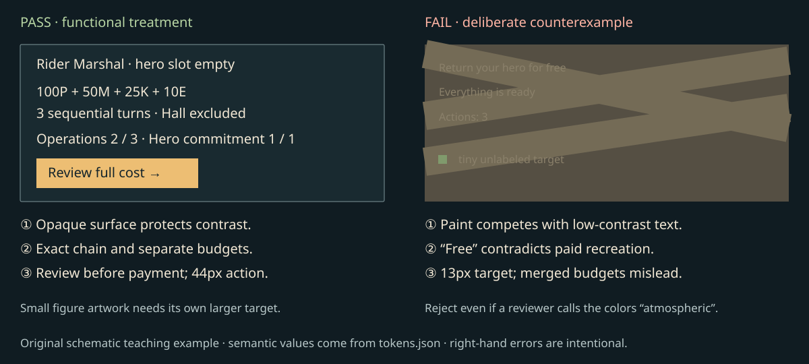

# Review rubric and creation workflow

Reject work on a concrete failed criterion; don't approve it merely because it resembles a named game. [Source authority](source-authority.md), [art bible](art-bible.md), [UI/UX](ui-ux.md), [tokens](tokens.json) and [asset specifications](asset-specifications.md) own the actual rules. This rubric owns the acceptance process.

## Gates

| Gate | Pass | Fail / required correction | Evidence |
|---|---|---|---|
| Source status | Every important lore claim has a inspected locator and evidence class; new work labeled | Unread whole-book/talk claim; invented biography presented as canon | Ledger + actual inspected page/frame scope |
| Roster | Exact 55 IDs, 54 factions; Melkor two alternatives; three human kingdoms; separate named/generic Istari | Alias loses profile, named Blue Wizards merged, fourth human kingdom added | Validator against root roster |
| Gameplay | Four stocks; separate 3+1 budgets; independent queues; one occupied/reserved slot; known costs before commit | Fifth currency, free return, captive plus new hero, doctrine reset, enemy secret leaked | Flow/state review and later runtime tests |
| Faction distinction | Economy, habitat, material and vulnerability visible in seven domains | Every settlement a castle or every habitat a human barracks | Matrix comparison; blind identification test later |
| Composition | Landforms read before objects; scale hierarchy and useful quiet space | Giant map hero, floating diorama, panels covering sole route | Render at declared size; landmark/travel test later |
| Painting | Broad masses, selective edges, chromatic shadows, physically meaningful material wear | Uniform brown, noise everywhere, chrome/plastic surface | Full-size and thumbnail visual review |
| Portrait and map continuity | Same identity cues across portrait and tiny figure; humanoid anatomy coherent | Actor/game likeness, glamour stereotype, unrelated map costume | Side-by-side inspection and silhouette sample |
| Functional contrast | Every used text pairing meets 4.5:1; boundaries/focus 3:1; opaque reading surface | Passing palette swatches used over uncontrolled paint | Token calculation + rendered CSS sampling |
| Input and scaling | 44px controls; visible focus; alternate entity list contract; 200% reflow | Tiny art equals tiny hit target, overlap selects arbitrary unit, clipped cost | DOM measurements and keyboard/render checks; runtime list test later |
| Information | Age/confidence/known vs unknown explicit, public progress universal | Intelligence gates basic UI, color reveals hidden enemy | Known/unknown state inspection, later runtime adversarial test |
| Provenance and delivery | Actual files, exact size/hash, origin, status and layer limits | Prompt marked as generated image; reference art labeled production; fake alpha | Manifest validation and image inspection |
| Honest completion | Measured/static/visual/deferred results separated | Mockups claimed to prove gameplay, balance, engine performance or complete accessibility | Verification report plus explicit future test list |

A lore/rule/data-leak failure blocks acceptance. A material visual/readability failure requires correction and rerender. A future runtime claim remains explicitly unverified; it cannot be “passed” by a static screenshot.

## Annotated examples

This authored comparison is a teaching artifact. Its right half intentionally fails and must never become a palette or component source. The left uses token pairs and separates budgets; the right combines low contrast, a 13px target, a hidden-cost promise and an ambiguous action count. The comparison's drawn action is schematic, not a working button.

| Delivered example | Successful observation | Remaining limitation / what would fail |
|---|---|---|
| [Strategic render](gallery/evidence/strategic-1440.png) | Cool river/land mass dominates; small settlement and separate reading plaques; tiny figure selection has larger target | Unlabeled decorative riders are not runtime units; actual route hit testing and figure discrimination remain untested |
| [Local render](gallery/evidence/local-1440.png) | Hero death does not remove economy; exact two-stage Rohan cost and facility states visible | Generated workers vary in size and are not calibrated sprites; no working economy behind the labels |
| [Faction render](gallery/evidence/factions-1440.png) | Distinct work/materials, intimate portraits and explicit 14px silhouette / 44px target study | Portrait sheet has no alpha/layers; model-generated lower figures are enlarged costume studies, not world sprites |
| [Map render](gallery/evidence/map-1440.png) | Solid/dashed/double/hatched meanings have text equivalents; uncertain district labeled | Schematic topology is invented; resource sufficiency, exact path costs and balance require testing |
| [Object/dialogue render](gallery/evidence/dialogue-1440.png) | Original memory attached to material repair, no hidden payment; close portrait separate from map scale | Illustrative speech is not adopted canonical dialogue or a fully tested quest |

## Creation → implementation → verification

1. **Select sources.** Read shared skill and current authority. Record exact profile IDs, source classes, book/scene locators and chronology mode. Do not use an unavailable reference as observed evidence.
2. **Write a brief.** Use [templates](templates.md); include camera, hierarchy, scale, silhouette, materials, palette, light, exclusions, exact UI strings and acceptance. Name proposed numerical choices and alternatives.
3. **Block the place.** Establish geography, paths, building work and available information before adding brush texture. Compare any canonical regional geometry to the supplied map; label local invention.
4. **Create art and UI separately.** Use original paintings for atmosphere, exact live text for costs and states, semantic overlays for control. Keep reference imagery outside production. Add real files and provenance to the manifest; no speculative variants marked delivered.
5. **Inspect at size.** View every required study at declared reference size, compact width and text scaling. Inspect silhouette, material/lighting continuity, occlusion, reading order and label collision. A successful source PNG is not a successful composed UI.
6. **Implement against contracts.** Feed approved tokens, exact roster IDs, manifest statuses and state contracts to the eventual engine. Reject unspecified mechanics rather than inventing them during UI code. Preserve own/known/public/unknown data boundaries.
7. **Review.** Reviewer checks source fidelity, art consistency and usability using rendered evidence. Fix findings in their owning resource, then refresh dependent screenshots/manifests.
8. **Verify.** Verifier runs parsers/coverage/contrast/path/file checks and actual gallery interactions. Record failures and fixes. Later runtime QA must exercise state transitions, input methods, assistive tech, performance and playtests separately.
9. **Track and stage.** Coordinating parent inspects the complete staging set, preserves concurrent work, appends tracking and stages under AGENTS.md. Never commit/push.

For a changed token, rerun all affected contrast/render cases. For a changed roster, regenerate/validate the full coverage matrix. For a source correction, update its ledger interpretation and all affected examples; don't silently edit historical documents. For a client adapter, parse it and distinguish route existence from fresh-client loading.
