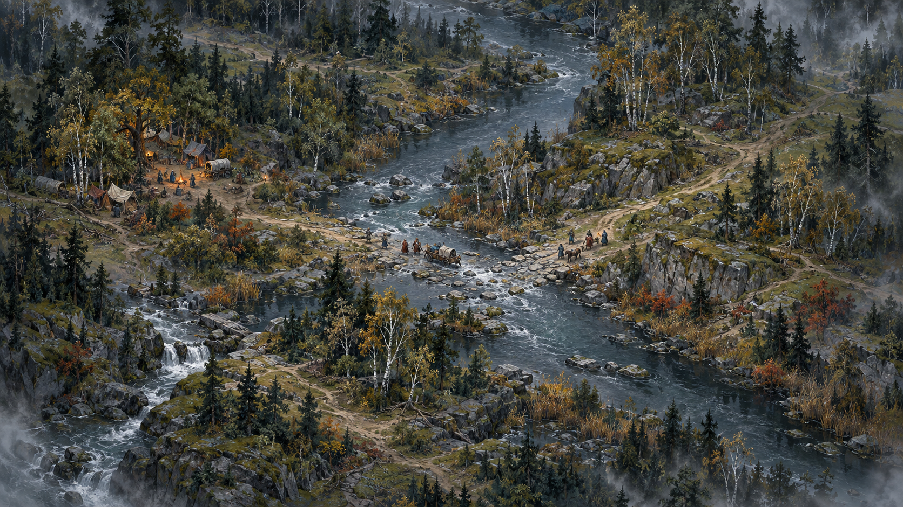

# THE POWERS AND PEOPLES OF ARDA

## An isometric strategy game from The Silmarillion

**Expanded adaptation report | Revision 2 | 29 September 2026**

Choose a named Power, a wandering Wizard, a people and culture, or a creature sovereign. Build a way of life around their particular gifts, dependencies and ambitions. Direct an expressive, tiny figure inside an immense painted world whose rivers, cities, forests and histories matter.

**Recommendation:** a single-player, turn-based narrative strategy sandbox with radically different playable Origins, consequential diplomacy, direct character control and regional warfare. All fourteen Valar are individually playable. Melkor, Sauron and the Istari have their own systems; Elves, Dwarves, human peoples, Orcs and major creatures have complete campaign routes.

The existing original Brethil concept remains the visual scale reference. This is a composition study, not a canonical map or gameplay screenshot. Working title and all systems are design proposals.

---

## 01 / The redesign in one view

**The player now chooses their place in the world's hierarchy.** The original Brethil march-warden campaign becomes one scenario in a much broader game. Its restriction to a mortal regional leader is superseded. Gods are selectable protagonists with controllable embodiments and world-shaping decisions; they are not merely patrons on a bonus screen.

| Layer | Choice and effect |
|---|---|
| Origin | Vala, Dark Lord, Istar, other Maia, people/culture, or creature; determines the core rules |
| Identity | A unique named being, original leader, house, community or creature; determines relationships and starting circumstances |
| Vocation or doctrine | A compatible practice such as craft, command, guardianship or intrigue; changes abilities and progression |
| Campaign ambition | A declared objective contract: sanctuary, independence, dominion, restoration, coalition, discovery or survival |
| Era and map | The default Mythic Sandbox combines ages explicitly; historical scenarios limit available identities and artifacts |

**The intended experience:** Aulë builds and teaches; Ulmo sustains isolated refuges through waterways; Sauron makes useful institutions dependent on him; Gandalf enables independent allies; an Orc clan struggles to hold its own territory; a Dragon bargains from a lair and a position of terrifying local strength.

The shared game is about commitments on a map. Everyone observes, travels, negotiates, allocates effort and responds to consequences. Their economies, available actions and definitions of success differ. A Wizard can complete a campaign without building a conventional capital. A recovery-focused Vala can win without topping a kill count.

**Map and tone:** high isometric view; beautiful, small characters and props; vast painted geography; expressive portraits during councils; melancholy, wit, ideological friction and moments of tenderness. The Disco Elysium influence belongs in presentation, interior debate and consequential conversations.

**Reading guide:** sections 02-08 define the shared game; 09-18 present individual Powers and Wizards; 19-26 cover peoples and creatures; 27-31 cover progression, example play, visual design, production and evidence. All numbers are starting hypotheses for a prototype, not tested balance claims.

---

## 02 / What the whole book becomes in this game

The original reading covered the supplied 461-page PDF: introductory material, Ainulindalë, Valaquenta, the full Quenta Silmarillion, Akallabêth, Of the Rings of Power and the Third Age, tables, notes, index, appendix and maps. This revision uses that reading while changing the playable scope.

**Creation becomes stewardship.** The world is interdependent, and its makers understand it incompletely. Aulë's making and Yavanna's concern for living things suggest competing uses of the same landscape. Build a mine, a road or a haven and change the possibilities for everyone connected to it. Eru's granting of independent life to the Dwarves remains distinct from a player's ability to construct things. [B: 26-33, 56-59]

**The First Age becomes a contest over commitments.** Irreplaceable works, inherited claims and competing loyalties create strategic pressure. Fëanor's oath and Finrod's promise demonstrate different consequences of binding oneself. Record promises with specific parties, terms, witnesses and deadlines. Players can keep, renegotiate or break them; a single morality bar cannot describe the result. [B: 89-114, 209-217, 319-324]

**Númenor becomes institutional capture.** Sauron can lose a military confrontation and gain influence over those who defeated him. Prosperity, independence and legitimacy therefore need separate measures. A rich realm may have become strategically dependent on a hostile adviser. Fear of mortality is a political and personal pressure, not a racial debuff. [B: 327-351]

**The Rings become attractive dependencies.** A powerful gift may preserve what the recipient values while exposing them to another will. Artifacts need makers, custodians, relationships and histories. Destroying the controlling object may also end cherished benefits. The game must show those dependencies before a decisive choice. [B: 360-362, 370-378]

**Hope remains effective.** Friendship, pity, rescue, craft and relinquishment repeatedly change events. Preservation and independence must therefore be complete victory routes. A game in which every successful leader eventually becomes a conqueror would miss much of the book.

**The crucial adaptation change:** these patterns now generate possible futures. The campaign does not force a betrayal, downfall or defeat merely because it happened in the narrative. Historical starting conditions can be faithful while the player's continuation branches. Cross-age combinations receive a clear Mythic Sandbox label.

---

## 03 / Selecting an Origin

Use **Origin** as the menu label. The user's requested choices include different kinds of being, cultures and orders; a single race dropdown would conceal important differences.

| Family | Selectable design roster |
|---|---|
| Valar | Manwë, Varda, Ulmo, Aulë, Yavanna, Námo, Irmo, Nienna, Oromë, Tulkas, Nessa, Vána, Estë, Vairë |
| Dark Lords | Melkor/Morgoth; Sauron |
| Istari | Gandalf/Olórin, Saruman/Curunír, Radagast, configurable Unnamed Eastern Istar |
| Other Maiar | Melian, Ossë, Uinen, Arien, Tilion, Eönwë, Ilmarë, Balrog |
| Elven cultures | Noldor, Sindar, Vanyar, Falmari, Nandorin/Silvan community profiles, Avari |
| Dwarves and humans | Dwarven realms; Edain; Númenóreans; Dúnedain; Rohan; plural eastern and southern human communities |
| Orcs and creatures | Orc clans, Ents, Great Eagles, Dragons, Troll bands, great wolf/Warg packs, great spider broods |
| Small communities | Hobbits, as a sparse-source later-age option |

Every listed pack has an economy, two signature actions, a combat role, magic access, items, a perk, a counter and a recommended ambition in the following roster. Culture subprofiles change starts without pretending that every city is a separate species. Individual historical heroes can be leader presets on top of these packs; a complete cast of every named person is a separate content task.

**Uniqueness:** one instance of each named identity and each unique artifact per campaign. Melkor and Morgoth are era configurations of one being. Gandalf and Olórin are one identity; Grey and White are states, not duplicate heroes. An original Elven leader is still compatible with a named lord governing another realm.

**Boundaries:** Eru remains the source of the world, rather than a selectable peer faction. Half-elven ancestry is a character background, with exceptional destiny decisions where supported; it is not a generic empire or a freely repeatable immortality toggle. Nazgûl are era-dependent, Ring-bound leaders or agents arising from human recipients, not a biological race. Unique beings such as Ungoliant require authored identity scenarios rather than a claim that their nature is fully known.

**Start screen:** show the actual start, upkeep, magic permissions, direct-control options, objective, difficulty and lore liberties. All requested families are available in sandbox; historical availability is a filter the player chooses.

---

## 04 / Campaigns, geography and time

**Mythic Sandbox is the default.** It can place the fourteen Valar, Melkor, Sauron, Istari and later peoples in the same playable world. This is an openly counterfactual assembly of identities, geography and institutions. It does not claim that they coexisted in those states in a particular historical year.

Three campaign formats share the rules:

- **Confluence:** a generated or authored alternate-history world, with objectives tailored to the selected Origins. Target 24 strategic turns for the first complete sandbox scenario; duration is a playtest question.
- **Historical divergence:** an authored era and date, with appropriate population, artifacts and forms. After the start, choices can create alternate outcomes. An optional chronicle mode instead follows more constrained events.
- **Focused scenario:** eight to twelve turns in a limited region. Brethil remains a strong tutorial for human leadership; a coast, recovery network or threatened workshop teaches a Power's systems.

**One strategic turn is one week in the prototype.** It is a planning interval, not permission to grow a mature civilization in a month. The world begins with populated settlements, adult specialists and established forests. Roads can be repaired; a monumental city cannot appear from a two-turn button. Long works have playable stages: survey, secure labor and material, establish a foothold, complete a useful phase.

Keep three connected scales: the world overview shows territories, known routes, institutions and distant commitments; an isometric regional map shows terrain, settlements, parties and production; a closer field view allows direct character interaction and a prepared encounter. Figures remain physically small at the normal strategic zoom. Entering a field view uses the leader's existing assignment, not extra free travel.

Travel consumes time along actual routes. An embodied Power is present somewhere; distant domain actions require an established connection or a disclosed special ability. Celestial characters use a committed route and a local manifestation for interactions, an explicit gameplay invention. Simultaneous threats remain possible even for the strongest player.

**Map generation must support the choice.** Ulmo needs consequential watersheds; Ossë and Uinen need working coasts; Ents need connected habitats; Dragons need defensible lairs and targets; Dwarves need underground access and food exchange. Multiple routes, distributed objectives and imperfect information give smaller factions decisions. A character must never load into a map where their main verbs have no use. Scenario setup prevents unavoidable opening-turn destruction of a rival's only viable objective; initial distance, warning and allied protection must make a response possible.

---

## 05 / The shared strategic loop

1. **Read reports.** Inspect who observed what, where and when. Separate confirmed conditions, aging information and disputed accounts.
2. **Convene.** Speak with companions, delegates or visitors. Select promises and policies; negotiations can fail or produce counteroffers.
3. **Allocate three Orders.** Commit a realm, network or lair to three major operations: construct, escort, muster, investigate, trade, restore, raid or negotiate a mission.
4. **Assign the leader.** Choose one commitment: travel, attend a field encounter, lead a regional undertaking, negotiate personally or recover. A large action can tie up this slot across turns.
5. **Resolve simultaneously.** Standing operations, travel, opposition and new consequences occur in a disclosed sequence. Review causes and uncertainty; then begin the next week.

**Orders represent exceptional coordination, not every worker's movement.** Existing farms, workshops and garrisons run under standing policies. Each Order covers one task force or project at one connected operating area. Multiweek projects, active campaigns and escorted convoys occupy their Order slot until finished or cancelled; standing policies cannot initiate free conquest or construction. A commander cannot multiply the three-order budget by hiring captains; delegation changes reach and competence, not the number of major new initiatives. Autonomous allies spend their own budgets and can refuse incompatible requests. A joint operation uses one Order from each committing side.

The leader slot is additional to the three Orders, but cannot duplicate the same effect. If a regional ability says it needs a construction, escort or recovery operation, that operation also occupies an Order. The commitment ledger previews both costs. A normal dialogue exchange is free to read; a binding assignment consumes its shown resources when accepted. Scouting resolves before the next week's planning and cannot retroactively inform simultaneous orders.

**Personal readiness starts at 6.** It measures the selected embodiment's ability to keep acting, not equal supernatural strength. Small field abilities usually cost 1, heavy ones 2. Recovery uses the leader commitment and restores 3, up to 6. Travel and ordinary conversation do not generate readiness. No automatic weekly refill means sustained intervention creates a real scheduling choice.

**Regional actions usually cost 3 readiness and one leader commitment.** A Great Act requires 6 available readiness, reserved in full at initiation, and two consecutive leader commitments. Completion consumes all 6. Cancellation or interruption consumes 3 and releases the other 3; committed labor and goods follow their stated loss rules. The intended effect occurs only after the second uninterrupted stage. Its preparation, footprint, material dependencies and interruption consequences are visible. No effect occurs at a distance without the stated reach. These are initial tuning values; an action card can override them explicitly.

Field encounters resolve within the week's commitment. A character cannot reset readiness by leaving and re-entering the encounter. Basic movement, ordinary defense and withdrawal remain possible at zero; extraordinary abilities do not.

---

## 06 / Resources, magic and the cost of power

Display at most three prominent economic indicators for the current Origin. Keep richer local details in the selected site or army. Do not invent a worship currency for every god.

| Resource type | What it does | Examples |
|---|---|---|
| Stocks | Held, transferred and spent; production requires a real source | Provisions, timber, ore, tools, treasure |
| Capacity | Limits simultaneous commitments; it is occupied rather than consumed | Skilled crews, beds, transport, envoys, supported companies |
| Conditions | Enable or change an action; they are not spendable points | Trust, viable soil, a navigable river, a mandate, concealment |
| Personal readiness | Pays exertion and extraordinary interventions; returns through recovery | Embodied actions and regional abilities |

A Vala may not need meals, but their messengers, guests, workers and allied armies do. A Dragon needs territory and prey as well as a hoard; a Wizard needs hospitality, contacts and safe travel. A remote refuge does not receive supplies merely because it belongs to a powerful faction.

**Every magical action has a source, reach, target, duration and consequence.** Ainur exercise their particular powers; trained peoples use appropriate lore, craft and individual gifts; artifacts carry bounded effects and dependencies; patron agreements grant a specified service. Selecting an Elf does not unlock every Vala's spell. Orcs, Dwarves and humans can acquire knowledge without receiving an interchangeable elemental spell list.

Use three action scales. A **local art** changes one encounter. A **regional undertaking** changes an operating area. A **Great Act** creates a lasting, highly consequential work or intervention. Great Acts have a warning phase and contestable preparations. Opponents can evacuate, negotiate, disrupt support or bring an opposing Power; ordinary soldiers need not be able to cancel any god by touching a capture point.

**Persistent works occupy attention.** As an initial rule, an Ainu can sustain up to three magical Anchors; ordinary buildings do not count. A maintained veil, protection or regional transformation may occupy one or two slots, stated on its card. Each Anchor defines an area, autonomous limits, dependencies and disruption route. Active remote guidance consumes the same leader slot as local action. Releasing an Anchor removes only its sustained magic, not completed physical construction; the slot frees at turn end and spent resources are not refunded. This is an invented commitment limit, not a claim that all good Powers gradually expend their souls.

Melkor has a separate, irreversible **Dispersion** track: investing himself in durable domination enlarges his apparatus and reduces his freely deployable personal potency. Sauron has a distinct Ring relationship. Neither system is replaced by generic resting mana. Domain conditions supply limits as well: no instant mature forest on sterile ground, no water control in a dry chamber, no omniscient information from a single bird.

---

## 07 / Combat, embodiment and strategic fairness

**Power levels remain different.** Tulkas can overpower an ordinary company locally. A human leader can still win a campaign by evacuating a population, denying access to an artifact, preserving an independent coalition or completing a different contested objective. Equal action budgets constrain attention; they do not imply equal damage, health or reach.

A field encounter begins with intelligence, routes, cover and a plan. Orders specify target, stance, formation, acceptable losses and fallback. The selected leader can move, intervene, talk or use an ability within that commitment. Combat advances through short simultaneous tactical phases; the player reviews the next phase before confirming. This preserves deliberation while keeping positioning meaningful.

Forces have **cohesion, fatigue, supply and injuries**. Fear can scatter them; loss of an exit can turn a manageable battle into disaster. Lethal outcomes are possible, but rescue, surrender, diversion and retreat are valid plans. Ordinary troops remain useful around divine conflicts as scouts, escorts, builders and guardians of objectives that brute force alone cannot secure.

**Embodiment is not the same as ultimate existence.** Track a spirit's presence, physical form and institutions separately. Losing a form can remove direct control, break command and decide the campaign without annihilating a spirit. Each named Ainu has an explicit scenario rule for confinement, withdrawal and possible re-embodiment. No universal free respawn applies to Valar, Balrogs and Wizards. A disembodied player cannot retain normal bodily combat while ignoring physical risk.

Mortal leaders can die and be succeeded. Elven death is consequential and never an instant battlefield respawn; any return requires an authored scenario. Gandalf's White state is not a repeatable upgrade obtained by dying. Morgoth after expulsion requires an acknowledged sandbox premise to return. [B: 31-32, 323, 378]

**Fairness is access to meaningful objectives.** Before a campaign begins, the setup checks that each player has viable starting terrain, at least two usable strategic approaches and enough warning to respond to a major threat. Smaller factions receive appropriate allies, concealment, dispersed holdings or objective timing. These are visible scenario conditions, not invisible damage scaling.

The base target is single-player against AI with adjustable opposition. Unrestricted god-versus-mortal duels are experimental sandbox matchups. Competitive multiplayer would require separately tested pairings and objective rules; this report does not claim that the entire roster is equally strong in a duel.

---

## 08 / Ambition, diplomacy and victory

Choose an **Ambition Contract** at setup. It states the outcome, required contribution, contesting forces, deadline, failure conditions and alternatives if circumstances change. Every roster card supplies a signature route; another compatible ambition can be selected. Conquest is available where appropriate, but support, survival and independence receive equally complete campaigns.

| Example contract | Proposed measurable success | What makes it contested |
|---|---|---|
| Estë: a living recovery network | Three supplied refuges, two functioning routes, sustained recovery across the final four turns | Raids, displacement, interrupted care and competing supply needs |
| Orc clan: independence | Two viable settlements, provisions through the final four turns, no compulsory tribute or hostile garrison | Former overlord, resource access and divided clan interests |
| Sauron: institutional dominion | Three functioning foreign centers under enforceable dependency, including one rival seat | Exposure, secession, independent production and coalition action |
| Ulmo: the surviving chain | Three occupied refuges linked by usable water or agreed portage, with required evacuations completed | Dry divides, blockades, damaged crossings and misinformation |
| Gandalf: allies who can stand | Two independently capable allied institutions and defeat of the declared threat | Distrust, diversion, fragile succession and enemy infiltration |

Numbers above belong to an illustrative 24-turn scenario, not every campaign. A contract generates appropriate contested locations; it cannot be won safely in an irrelevant corner while everybody else plays another game. Some contracts are compatible and permit shared victory. Others collide and make negotiation consequential.

**Contribution must be attributable.** A support player succeeds through maintained capacity, timely interventions and actual commitments, not by briefly joining the winning coalition. Repeatedly injuring one's own subjects cannot generate recovery score. Self-created suffering does not count as restorative progress; measure durable safety and restored function against scenario pressures, with action provenance where necessary. No currency is earned merely for having grief.

Treat relations as agreements between named parties. Record passage, aid, custody, trade, refuge and military terms. The player sees the beneficiary, witnesses, expiry and breach consequences. A promise can conflict with another; characters can object, renegotiate or refuse. A race does not force a moral alignment. Orc independence and reformed political paths are explicit alternate-history options, not claims that the book already narrates them.

Narrative failures change options instead of merely closing content. A failed persuasion might expose a disagreement, create a costly compromise or require another route. Critical information must have more than one discoverable path. Consequences remain legible on the map: a closed ford, an emptied village, an autonomous workshop, a guarded haven.

---

## 09 / Valar: Wind, stars and water

All powers below are **proposed gameplay**, inspired by the cited source. Each controls a small visible embodiment. Local abilities normally cost 1 readiness; heavy Grapple costs 2. Regional abilities normally cost 3 plus the leader commitment and any stated Order, labor or materials. Major variants use Great Act rules. Canonical focuses are identified; other items are inventions.

### Manwë - coordination and air

**Source:** Winds, birds, far sight with Varda, and rule directed toward peace (37, 49). **Economy:** Messenger reach, willing allies, maintained observation posts.

- **Crosswind:** Deflect an approaching missile volley or open space around companions. **Cost:** Exertion; sustained wind occupies attention.
- **Skywatch:** Assign bird messengers to one region, accelerating warnings and revealing exposed movement. **Cost:** Regional commitment and messenger travel time.

**Perk:** Allied contingents coordinate more reliably within an intact communication network. **Focus:** Canonical sapphire sceptre (49). **Combat:** Positioning and ranged protection. **Weakness:** Underground threats, deception, and storms elsewhere compete for attention; aerial reports are incomplete. **Victory:** Preserve a functioning coalition and its protected corridors through a major crisis.

### Varda - light and orientation

**Source:** Stars, light, listening with Manwë; Melkor fears her (37). **Economy:** Open sightlines, surveyed routes, beacon upkeep.

- **Starlit Ground:** Illuminate a small area, exposing silhouettes and weakening concealment. **Cost:** Exertion and the risk of revealing allies too.
- **Guiding Constellation:** Establish a regional night-navigation network that reduces lost travelers and delayed messages. **Cost:** Survey time and sustained commitment.

**Perk:** Parties recover cohesion under visible stars. **Focus:** Proposed star-vessel; not a named canonical artifact. **Combat:** Detection and resistance to fear. **Weakness:** Roofs, deep rock, obscuring weather, and broken sightlines limit reach; light is not universal truth detection. **Victory:** Reconnect isolated communities and preserve safe passage through an age of darkness.

### Ulmo - rivers and persistence

**Source:** All waters, news carried through them, enduring care for the abandoned; shell horns (37-38, 50). **Economy:** Connected waterways and healthy springs.

- **Turn the Current:** Make a temporary crossing safer or disrupt enemies standing in water. **Cost:** Exertion; water must exist locally.
- **Voices of Water:** Attend to a watershed for distress reports and route warnings. **Cost:** Regional commitment and interpretation time.

**Perk:** Water-linked enclaves retain communication when roads fail. **Focus:** Canonical Ulumúri. **Combat:** Terrain control and extraction. **Weakness:** Dry divides interrupt reach; floods can harm those he protects, and reports cannot identify every danger. **Victory:** Maintain a chain of surviving refuges despite conquest of the surrounding land.

---

## 10 / Valar: Making, life and judgment

### Aulë - construction and craft

**Source:** Materials, smithcraft, generous teaching; Dwarves' creation requires Eru's intervention (38, 56-59). **Economy:** Ore, timber, tools, skilled labor, workshops.

- **Brace and Shape:** Repair a failing gate or fashion nearby material into cover. **Cost:** Materials and exertion.
- **Great Commission:** Build a bridge, fortress work, or major workshop. **Cost:** Skilled labor, substantial materials, time, and regional commitment.

**Perk:** Teaching spreads capabilities between willing communities. **Focus:** Canonical hammer (56). **Combat:** Fortification, repair, and siege engineering. **Weakness:** Resource dependence, vulnerable worksites, and ecological conflict; tools can empower enemies who capture them. **Victory:** Complete a network of enduring public works while keeping its communities independent and productive.

### Yavanna - living territory

**Source:** All growing things, ecological interdependence, trees' vulnerability, forest guardians (38, 58-59). **Economy:** Soil health, viable habitats, water, accumulated growth time.

- **Rootward:** Existing vegetation braces a position, slows pursuit, or shelters wounded companions. **Cost:** Exertion and temporary local growth stress.
- **Restore the Canopy:** Rebuild a damaged habitat and its food, concealment, and defensive functions. **Cost:** Water, protected time, and regional commitment.

**Perk:** Diverse habitats recover more reliably than single-purpose plantations. **Focus:** Proposed living staff. **Combat:** Area denial and defensive depth. **Weakness:** Fire, poisoned soil, and repeated exploitation; mature forests cannot appear instantly. **Victory:** Establish a connected, inhabited sanctuary whose renewal exceeds its destruction and extraction.

### Námo / Mandos - boundaries and judgment

**Source:** Keeper of the dead, memory, judgments delivered at Manwë's bidding (38-39). **Economy:** Protected sanctuaries, hearings, recognized agreements, time.

- **Threshold of Waiting:** Hold a narrow passage temporarily, protecting evacuation or a parley. **Cost:** Exertion and remaining present at the threshold.
- **Pronounce Judgment:** Following a council mandate and hearing, impose a defined pact with visible consequences for breach. **Cost:** Mandate, preparation time, and continuing commitment.

**Perk:** Witnessed agreements are harder to obscure or casually abandon. **Focus:** Proposed seal of judgment. **Combat:** Containment and protection. **Weakness:** Slow process, disputed jurisdiction, and opponents refusing settlement. No repeatable resurrection or detention of mortal souls. **Victory:** End a cycle of retaliation through an enforceable settlement and surviving sanctuaries.

---

## 11 / Valar: Dreams, endurance and the hunt

### Irmo / Lórien - dreams and preparation

**Source:** Visions, dreams, restorative gardens with Estë (39). **Economy:** Quiet gardens, protected rest, willing participants.

- **Veil of Drowsing:** Slow alertness in a small area, opening a retreat or infiltration opportunity. **Cost:** Exertion; disturbance breaks the effect.
- **Dream Council:** Consenting allies explore possible responses to a known danger, gaining prepared contingencies. **Cost:** Rest time and regional commitment.

**Perk:** Rested companions retain more preparation benefits after setbacks. **Focus:** Proposed dream-lantern. **Combat:** Disruption, ambush preparation, and escape. **Weakness:** Noise, pressure, sleeplessness, and ambiguous interpretation; dreams do not disclose guaranteed futures or command other minds. **Victory:** Bring an endangered coalition through successive crises using foresight and preparation rather than territorial supremacy.

### Nienna - endurance and reconciliation

**Source:** Pity, endurance in hope, sorrow becoming wisdom (39). **Economy:** Caregiving capacity, time, willing listeners, restitution.

- **Remain With Me:** Stabilize nearby allies against panic long enough to regroup or withdraw. **Cost:** Exertion and staying exposed with them.
- **Council of Mourning:** Help willing communities acknowledge losses and negotiate practical reconciliation. **Cost:** Time, care, and agreed restitution; neither grief nor blame is erased.

**Perk:** Defeat causes less lasting fragmentation when survivors receive support. **Focus:** Canonical grey hood (102). **Combat:** Morale support and rescue. **Weakness:** Limited immediate damage; domination and ongoing injury can undo agreements. Grief is never farmed as currency. **Victory:** Preserve communities through disaster and achieve reconciliation among previously hostile survivors.

### Oromë - pursuit and wild routes

**Source:** Hunter of monsters, forests, horses, hounds, Nahar and Valaróma (39-40). **Economy:** Scouts, trained mounts, trail knowledge, safe wild corridors.

- **Mounted Interception:** Pursue a fleeing threat or break an attack on travelers. **Cost:** Exertion, distance, and the danger of isolation.
- **The Great Hunt:** Coordinate trackers to discover and dislodge a specific regional predator or raiding force. **Cost:** Scout effort, time, and regional commitment.

**Perk:** Pursuit retains useful tracks longer after contact. **Focus:** Canonical Nahar and Valaróma. **Combat:** Mobile interception and targeted strikes. **Weakness:** False trails, ambushes, and fortified interiors; pursuing one threat leaves others free. **Victory:** Make a threatened frontier traversable and defend its migrations without stripping its wilderness.

---

## 12 / Valar: Strength, movement and renewal

### Tulkas - decisive intervention

**Source:** Extraordinary strength, unarmed wrestling, speed, laughter, steadfast friendship; limited counsel (39). **Economy:** Readiness, positioning, allied logistics.

- **Grapple:** Pin or disarm one formidable opponent. **Cost:** Heavy exertion and exposure while committed.
- **Stand Forth:** Challenge a besieging champion, creating a public opportunity to settle a defined military stake. **Cost:** Travel, preparation, and commitment; refusal remains possible.

**Perk:** Fear has reduced effect while he can intervene directly. **Focus:** Canonical bare hands; no mandatory enchanted weapon. **Combat:** Powerful disruption of enemy leaders and siege breakthroughs. **Weakness:** Deception, dispersed threats, logistical attrition, and prolonged commitments. **Victory:** Break a sequence of major coercive threats while keeping allied settlements supplied and secure.

### Nessa - movement and cohesion

**Source:** Speed, deer, dance; can outrun swift creatures (39). **Economy:** Practiced coordination, clear paths, capable guides.

- **Fleet Circuit:** Dash between companions, opening coordinated evasions or a rapid withdrawal. **Cost:** Exertion and an unobstructed route.
- **Gather the Paths:** Train a region's volunteers in warning relays and rehearsed evacuation routes. **Cost:** Training time, guides, and regional commitment.

**Perk:** Moving groups remain together more reliably across difficult journeys. **Focus:** Proposed dance anklets. **Combat:** Rescue, flanking, and disruption through movement. **Weakness:** Immobilization, narrow defended passages, and cargo that cannot move at her speed. **Victory:** Bring dispersed communities through a moving front with their people, essential possessions, and mutual obligations intact.

### Vána - renewal and returning life

**Source:** Ever-young; flowers open and birds sing at her coming (40). **Economy:** Viable seeds, pollinators, seasonal work, tended gardens.

- **First Bloom:** Encourage surviving plants to recover a small damaged clearing, drawing birds and making resources accessible. **Cost:** Exertion and viable local life.
- **Season of Renewal:** Coordinate gardens and small holdings to restore short-cycle food and useful plants. **Cost:** Seeds, tending labor, time, and regional commitment.

**Perk:** Recently restored settlements regain everyday activity faster. **Focus:** Proposed flowering wreath. **Combat:** Sustain staging areas and improve recovery between engagements. **Weakness:** Frost, fire, infertility, and repeated disturbance; her quick renewal cannot replace Yavanna's mature ecosystems. **Victory:** Reestablish flourishing communities across a previously devastated region.

---

## 13 / Valar: Healing and memory

### Estë - recovery and respite

**Source:** Healing hurts and weariness, rest, grey raiment, Lórellin (39). **Economy:** Resting places, clean water, caregivers, protected time.

- **Gentle Hands:** Stabilize a nonfatal wound or relieve disabling exhaustion. **Cost:** Exertion and uninterrupted contact; no instant combat reset.
- **House of Rest:** Dedicate a refuge to recovery, reducing attrition and returning injured personnel over time. **Cost:** Supplies, caregivers, space, and regional commitment.

**Perk:** Fully rested units retain benefits longer before fatigue returns. **Focus:** Proposed grey healing mantle. **Combat:** Triage and evacuation support. **Weakness:** Overwhelming casualty rates, interrupted treatment, and endangered refuges; cannot resurrect the dead. **Victory:** Sustain a viable network of recovery that allows allied populations to survive a prolonged war.

### Vairë - memory and accountability

**Source:** Weaves events of time into the tapestries of Mandos (39). **Economy:** Recording labor, protected archives, interpretation time.

- **Read the Trace:** Reconstruct recent movement at an inspected location, distinguishing evidence from competing accounts. **Cost:** Investigation time and vulnerability while examining it.
- **Weave the Chronicle:** Make a region's commitments and witnessed history usable in diplomacy and planning. **Cost:** Archival labor, time, and regional commitment.

**Perk:** Destroyed settlements retain recoverable institutional knowledge if their records survive. **Focus:** Canonical storied webs; proposed portable loom. **Combat:** Reconnaissance and prevention of repeated tactical deception. **Weakness:** Observation and retrieval take time; memory is not rewind, prediction, or instant omniscience. **Victory:** Preserve a dispersed people's continuity and expose the betrayals sustaining an enemy coalition.

**Solo agency:** these support specialists can recruit companions and issue all ordinary strategic Orders. Their campaign threats, recovery sites and evidence disputes are designed around active decisions. Their victory does not require passive attachment to a stronger combat god. Manwë/Varda, Aulë/Yavanna and Irmo/Estë offer useful partnerships, but no spouse or partner is a mandatory team slot.

---

## 14 / Dark Lords

**Action tags:** L = local, 1 readiness; H = heavy local, 2; R = regional, 3 and one leader commitment; G = Great Act, 6 reserved and two commitments. All require their stated reach and means. Actions, costs, perks and objectives are proposed; source paragraphs describe their inspiration.

### Melkor / Morgoth - dispersed dominion

**Source:** greatest initial might; participates in others' powers, destroys and corrupts works, then disperses strength into his designs and becomes increasingly earthbound (32, 42, 127, 191-192).

**Economy:** mines, coerced labor, war foundries and corrupted territories. **Skills/magic/combat:** disasters, darkness, terror, monstrous hosts and immense personal force. **Items:** contextual iron crown and Grond; the crown contains Silmarils only when the scenario grants custody.

**Perk:** invest personal potency into durable servants or regional corruption. **Counter:** rescue laborers, destroy production, expose lies, attack dispersed commitments and assemble opposing Powers. **Victory:** break rival Powers' works and defeat their attempts at restoration; an alternative dominion route subjugates functioning realms. Primeval Melkor and later Morgoth are selectable configurations of one identity; combining their strongest states without costs is explicitly a sandbox override.

**Starting actions:** **Blacken the Passage [R]** prepare a region of terror and damaged routes; preview collateral and support costs. **Seed of Dominion [G]** bind a persistent instrument of corruption; increase Dispersion permanently.

### Sauron - organized dependency

**Source:** Aulë's former Maia; craftsman, deceiver, shapeshifter and commander; offers useful knowledge before domination (42, 195, 211-217, 360-362).

**Economy:** efficient workshops, client states, tribute and intelligence networks. **Skills/magic/combat:** disguises, interrogation through contests of power, terror assaults, werewolf operations and command coordination. **Items:** the One Ring only after forging; no Ring or Nazgûl automatically in a First Age start.

**Perk:** dependent partners improve his surveillance and mobilization. **Counter:** independent craft, refusing gifts, source verification, coalition warfare and an era-appropriate Ring quest. **Victory:** control functioning institutions and their rulers. His governing machinery distinguishes him from Melkor's destructive dispersion; he still possesses formidable direct force.

**Starting actions:** **Borrowed Face [L]** assume a permitted disguise and enter a social encounter; corroborated evidence can expose it. **Gifts of Order [R]** offer a real improvement tied to an inspectable dependency; requires an Order and a recipient.

**Sauron has four explicit states:** pre-Ring; Ring forged and possessed; Ring lost but surviving; Ring destroyed. Losing possession does not immediately remove his invested power while the Ring survives. Destruction is decisive after forging. His fair appearance is permanently lost after Númenor in historical configurations. A First Age start grants neither the One Ring nor the Nazgûl. [B: 20-21, 351, 361, 367, 374-376]

---

## 15 / The familiar Istari

### Gandalf / Olórin - independent allies

**Source:** pity, patience and wisdom; vigilant investigation, broad relationships, refusal of permanent office; Narya sustains him and rekindles courage (41, 372-375, 378).

**Economy:** hospitality, trusted contacts and allied provisioning. **Skills/magic/combat:** uncover hidden threats, rally failing formations, break terror and lead urgent interventions. **Items:** Narya when entrusted; a travel staff is proposed equipment, not a mandatory artifact identified here.

**Perk:** overlooked communities contribute unexpected capabilities. **Counter:** sever routes, discredit evidence and force simultaneous crises. **Victory:** independent allies defeat the threat without becoming his subjects. He is a formidable participant in battle, not a passive quest dispatcher; Narya is not established here as a fireball amplifier.

**Starting actions:** **Kindle Courage [L]** restore cohesion enough for an endangered group to act or withdraw. **Gather the Unlooked-for [R]** assemble independent contacts around a threat; requires an Order and consent.

### Saruman / Curunír - knowledge and control

**Source:** subtle speech, smithcraft, Ring lore, Council leadership and concealed self-interest; Orthanc and a bird-supported spy network (372-374).

**Economy:** workshops, controlled procurement and organized intelligence. **Skills/magic/combat:** persuasive negotiations, counter-sorcery research, prepared defenses and coordinated armed followers. **Items:** Orthanc is a stronghold; any personal experimental device requires clear proposed provenance.

**Perk:** convert researched enemy methods into production or countermeasures. **Counter:** independent testimony, inspect supply chains, deny materials and expose conflicting commitments. **Victory:** loyal path builds a capable coalition; domination path captures its institutions. Choice of path is adaptation. The One Ring is something to seek or contest, not his guaranteed starting equipment.

**Starting actions:** **Voice of Concord [L]** gain a temporary hearing or negotiated opening, not irresistible mind control. **Study the Enemy [R]** commit researchers and an Order to a specific countermeasure.

### Radagast - living intelligence

**Source:** friend of beasts and birds; lends aid to Saruman without perceiving his treachery (372, 374).

**Economy:** healthy habitats, local food and cooperation with dispersed communities. **Skills/magic/combat:** animal-borne warnings, terrain knowledge, refuge preparation and proposed nonlethal disruption of pursuit. **Items:** proposed field kit and waystation caches; no invented named canonical relic.

**Perk:** many small witnesses reveal movement that court spies miss. **Counter:** fragmented habitat, deceptive handlers, smoke and conflicting reports. **Victory:** keep a connected living landscape and its inhabitants beyond domination. Animal friendship does not grant universal mind control, omniscience or unlimited summons.

**Starting actions:** **Scatter the Pursuit [L]** use present cooperating wildlife to distract trackers, with no summoned army. **Living Witnesses [R]** assign a habitat-linked warning network; reports remain partial.

---

## 16 / An eastern mission, sanctuary and storm

### Eastern Istar - configurable mission

**Source:** others travel east and do not enter these tales; this passage supplies neither names nor a precise count (372). Do not present Alatar, Pallando, blue robes or later textual missions as established by this book. **Proposal:** a selectable **Unnamed Eastern Istar** with Envoy or Warden specializations, not a claim that exactly two existed.

**Economy:** local alliances and secure waystations. **Skills/magic/combat:** Envoy builds resistance coalitions; Warden protects routes and disrupts hostile mustering. **Items:** player-authored staff and seal with invented provenance.

**Perk:** culturally specific local access. **Counter:** exposed networks and rival alliances. **Victory:** independent eastern societies resist domination. Eastern peoples must have agency beyond supplying someone else's army.

**Starting actions:** **Quiet Counsel [L]** help a local delegate resist a specific coercive demand. **Eastern Compact [R]** organize a route network with willing local leaders and one Order.

### Melian - sanctuary and obligation

**Source:** wisdom, protective enchantment, a particular embodied relationship and the Girdle's withdrawal after Thingol's death (41, 231, 255, 295).

**Economy:** a sheltered realm, healing and selective hospitality. **Skills/magic/combat:** deny hostile passage, conceal routes, perceive malice and sustain allies. **Items:** entrusted lembas; the Girdle is an enchantment, not loot.

**Perk:** a prepared refuge protects more than its garrison could defend. **Counter:** disputes inside its borders, incompatible claims and exceptional threats; the source does not make the boundary absolute. **Victory:** a flourishing sanctuary whose protection remains trusted. Free-roaming Maia and Doriath-bound queen are distinct setup states; portable continent-wide Girdles are not source-faithful.

**Starting actions:** **Veil the Path [L]** obscure a prepared approach while remaining present. **Sanctuary Girdle [G]** establish a bounded protection around an inhabited realm; occupies two Anchors.

### Ossë - the storm coast

**Source:** coastal seas, islands, storms, a former defection and unruly violence (41).

**Economy:** ports, ship-service relationships and coastal access. **Skills/magic/combat:** storm fronts, surf barriers, naval interception and hazardous landings. **Items:** invest in marked sea routes and shoreworks, not a fabricated canonical weapon.

**Perk:** coastal terrain becomes an active military instrument. **Counter:** Uinen's calming, sheltered harbors, inland routes and forecasts. **Victory:** command strategically vital coasts without destroying the settlements or fleets needed to hold them. Storm force remains dangerous to friendly shipping; interface predictions make that a decision rather than random punishment.

**Starting actions:** **Break the Landing [L]** turn existing surf against a landing at risk to nearby ships. **Stormward Coast [R]** prepare a visible coastal storm front with stated safe and hazardous zones.

---

## 17 / Sea, Sun and Moon

### Uinen - safe seas

**Source:** sea life, calming waves, restraining Ossë and mariners' protection (41).

**Economy:** trusted safe passages, healthy fisheries and rescue networks. **Skills/magic/combat:** calm storm zones, protect evacuation routes, disperse dangerous surf and sustain convoys. **Items:** proposed haven beacons and rescue vessels.

**Perk:** reliable shipping makes distant allies economically viable. **Counter:** landward attack, blockade beyond protected routes, poisoned harbors and deception. **Victory:** sustain connected maritime communities through conflict. Her active battlefield role is control of sea conditions; she does not need a generic damage spell to matter.

**Starting actions:** **Still the Water [L]** calm a small dangerous passage long enough for rescue. **Convoy Haven [R]** protect a defined sea route with a supported escort operation and one Anchor.

### Arien - daylight and exposure

**Source:** fire spirit uncorrupted by Melkor, stronger than Tilion, bears the Sun; Morgoth cannot approach her and shields his land with fumes (125-127).

**Economy:** support from celestial and terrestrial collaborators, rather than a capital's tax income. **Skills/magic/combat:** plan illumination, reveal exposed movement and contest shadow cover. **Items:** the Sun's vessel is unique scenario infrastructure.

**Perk:** vast influence over when and where hostile operations are feasible. **Counter:** underground routes, smoke and simultaneous threats under cover. **Victory:** maintain illumination and deny durable regions to hostile darkness. Bending celestial routes is explicit invention; unlimited targeted solar bombardment would destroy both fidelity and playability.

**Starting actions:** **Unclouded Glimpse [L]** clear a local observation window to reveal exposed movement. **Course of Day [R]** commit illumination along an announced route; this celestial control is invented.

### Tilion - the night hunter

**Source:** Oromë's hunter with a silver bow; guides the Moon and defeats attacking shadow spirits; his course is wayward (125-127).

**Economy:** prepared watch routes and allied reports. **Skills/magic/combat:** night reconnaissance, interception of shadow forces and mobile ranged combat. **Items:** silver bow and unique lunar vessel.

**Perk:** maintain useful presence where daylight has passed. **Counter:** decoys, deep cover and divided patrol demands. **Victory:** protect passage and night operations while keeping shadow assaults from celestial approaches. Model route commitments as player choices; compulsory random wandering would erase agency.

**Starting actions:** **Silver Interception [H]** strike or intercept one exposed shadow threat. **Watch of the Moon [R]** commit to a night route and reconnaissance objective.

---

## 18 / Herald, messenger and terror champion

### Eönwë - the commissioned host

**Source:** Manwë's herald and banner-bearer, exceptional martial might, commands the western host; cannot personally pardon Sauron (40, 317, 320-322, 357).

**Economy:** coalition mobilization and expedition supply. **Skills/magic/combat:** formation command, decisive assault, protected surrender and artifact custody. **Items:** heraldic banner; weapon loadout is proposed.

**Perk:** turn authorized coalition strength into concentrated military action. **Counter:** dispersed enemies, exhausted supply and attempts to provoke breaches of terms. **Victory:** defeat the hostile power and deliver captives/artifacts under the agreed settlement. His commission shapes objectives; it should not turn his combat power off arbitrarily.

**Starting actions:** **Heralds Advance [H]** lead a prepared formation through a threatened point. **Commissioned Host [R]** coordinate a supplied expedition under explicit terms and one Order.

### Ilmarë - celestial communication

**Source:** named as Varda's handmaid, among chief remembered Maiar; little individual action is supplied (40). **Proposal:** celestial communications and coordination specialist.

**Economy:** observatories and messenger relationships. **Skills/magic/combat:** warning relays, illumination support and protecting couriers. **Items:** invented signal instruments, clearly labeled.

**Perk:** shorten information delays across allied regions. **Counter:** false signals and severed stations. **Victory:** sustain a warning network through a global crisis. Do not present this detailed role as recovered lore.

**Starting actions:** **Beacon Reply [L]** relay a verified warning between visible stations. **Chain of Witness [R]** maintain an agreed communications circuit with a staffed network Order.

### Balrog - terror and siege

**Source:** corrupted Maiar, fire and terror; Gothmog uses an axe, another Balrog a fiery thong; most are destroyed in the War of Wrath (42, 242, 307, 320).

**Economy:** stronghold provisioning and dependent warbands. **Skills/magic/combat:** shock charges, fire barriers, siegebreaking and terror. **Items:** axe or fiery whip; specialized loadouts are proposals.

**Perk:** break a defended position through embodied force. **Counter:** prepared terrain, dispersed formations, heroic sacrifice and superior Powers. **Victory:** secure a stronghold network or complete a warlord's objective. No automatic flight, generic infinite resurrection, or production line of new Balrogs is established here.

**Starting actions:** **Flame Barrier [H]** deny a short crossing while exposing the embodied attacker. **Break the Gate [R]** lead a prepared assault against one defended work with a warband Order.

---

## 19 / Elves: makers, courts and hosts

**Operation costs:** society-scale skills occupy one Order and the named crews, goods or consent. A personal encounter skill costs 1 readiness, or 2 for a heavy physical attack. A signature skill does not bypass movement, supply or an ongoing Order. **Ruinous Breath** costs 3 and exposes its firing lane before resolution. Exact quantities depend on the scenario scale; no racial skill creates free resources.

### Noldor - houses of makers and competing princes

**Economy:** workshops, ore, skilled labor, transmitted lore. 

**Skills:** **Masterwork Commission** improves one consequential item; **Joint Muster** coordinates allied houses. 

**Magic:** learned craft, songs and costly preservation.  **Items:** distinctive blades, lamps, crafted seals; unique artifacts require provenance. 

**Combat:** disciplined combined companies.  **Perk:** redesign existing infrastructure.  **Counter:** scarce specialists and disputed obligations make replacements difficult. 

**Objective:** complete and preserve a great work while sustaining its community. Houses have selectable politics, not inherited guilt statistics. [79, 135-146]

### Sindar - forest courts, marches and coastal communities

**Economy:** distributed woodland settlements, exchanges and maintained paths. 

**Skills:** **Hidden Approach** conceals movement; **Border Parley** establishes conditional passage. 

**Magic:** song, place-lore and enchantment through qualified individuals.  **Items:** cloaks, bows, axes and record-bearing textiles. 

**Combat:** prepared ambushes and territorial defense.  **Perk:** reliable local intelligence.  **Counter:** displacement and exposed routes weaken their advantages. 

**Objective:** maintain an inhabited, connected homeland through external pressure. Melian's Girdle requires Melian and is not a universal Sindarin racial spell. [117-122, 152, 196]

### Vanyar - fellowship and ceremonial hosts

**Economy:** skilled households, offerings and learned service. 

**Skills:** **Concord Assembly** repairs coalition cohesion; **Ordered Advance** strengthens a prepared host. 

**Magic:** learned song and relationships with Powers, never automatic divine control.  **Items:** standards, instruments and fine arms. 

**Combat:** cohesive elite formations.  **Perk:** stable long-term commitments.  **Counter:** expeditionary supply and slow replacement. 

**Objective:** sustain a coalition or complete a chosen intervention without abandoning its obligations. Civil institutions are underdescribed; this gameplay identity is extrapolation. [67, 79; chapter24]

---

## 20 / Elves: sea, woodland and independent communities

### Falmari - the Teleri of Aman

**Economy:** shipyards, fisheries, pearls and maritime exchange. 

**Skills:** **Swan-ship Passage** transports a difficult convoy; **Harbor Covenant** opens reciprocal shelter. 

**Magic:** sea-lore, song and craft, with weather intervention requiring a suitable ally.  **Items:** navigational instruments, woven sailcloth and heirloom vessels. 

**Combat:** mobile coastal defense and embarked companies.  **Perk:** dependable transport networks.  **Counter:** blocked harbors and inland commitments. 

**Objective:** connect scattered communities while preserving an irreplaceable fleet. Teleri elsewhere are not automatically members of this maritime polity. [75-80, 110-111]

### Nandorin / Silvan communities - selectable regional traditions

Choose an Ossiriand/Laiquendi or later woodland starting profile, not both as duplicate races. 

**Economy:** dispersed clearings, woodland produce and guide services. 

**Skills:** **Unseen Network** moves messages through cover; **Living Boundary** establishes guarded woodland access. 

**Magic:** local lore and inherited craft.  **Items:** practical bows, leaf-colored clothing, portable keepsakes. 

**Combat:** evasion, scouting and ambush.  **Perk:** settlements remain difficult to locate.  **Counter:** fire, habitat fragmentation and prolonged open battle. 

**Objective:** preserve connected woodland and political autonomy. [120-122, 154, 179; index “Silvan Elves”]

### Avari communities - diverse independent settlements

**Economy:** player-chosen local subsistence and exchange. 

**Skills:** **Independent Compact** forms a limited alliance; **Uncharted Passage** develops a locally known route. 

**Magic:** cultural knowledge defined by the authored community, without invented universal occult powers.  **Items:** regional tools, keepsakes and weapons. 

**Combat:** terrain-dependent companies.  **Perk:** flexible institutions outside western dynastic claims.  **Counter:** limited initial external contacts. 

**Objective:** establish recognition and security on chosen terms. The supplied book says little about their internal variety; names, constitutions and specializations require openly invented content. [67, 131, 358]

**Family tree:** Vanyar, Noldor and Teleri are the original Eldarin branches. Falmari, Sindar and Nandor belong within Telerin history; Laiquendi are a Nandorin subset. Silvan is a later population profile. Quendi, Eldar and the Light/Dark classifications overlap these histories and do not create duplicate race buttons. [B: 67-69; chart 383]

---

## 21 / Dwarves, Edain and Númenóreans

### Dwarven realms - ancestry and city tradition selected separately

**Economy:** mines, stonework, workshops and guarded trade. 

**Skills:** **Deep Survey** locates workable lodes; **Contract Forge** supplies an allied project. 

**Magic:** exceptional craft and learned inscriptions, not a generic rune-spell army.  **Items:** mail, masks, tools and commissioned treasures. 

**Combat:** armored close-order companies and engineered defenses.  **Perk:** repair and endurance.  **Counter:** food imports and vulnerable exits. 

**Objective:** sustain a prosperous independent hall and fulfill selected contracts. Durin's kindred is an attested house; Khazad-dûm, Belegost and Nogrod support distinct realm profiles-deep halls, protective armor, exceptional smithing. The book does not name every house descended from the Seven Fathers; do not mislabel those cities as three exhaustive genealogical houses. [56-57, 117-120, 143; chapter20]

### Edain - three distinct cultural starts within one mortal family of packs

**Economy:** households, farming, craft and alliance service. 

**Skills:** **Emergency Gathering** organizes dispersed people; **Sworn Partnership** negotiates mutual defense. 

**Magic:** healing lore and acquired craft; greater powers depend on specific people or allies.  **Items:** heirlooms, practical arms and witnessed tokens. 

**Combat:** adaptable mixed forces.  **Perk:** institutions can change within a generation.  **Counter:** casualties remove scarce experience. 

**Objective:** secure a freely governed homeland. Bëorian learning networks, Haladin woodland autonomy and Hadorian mustering offer different starts; none is a compulsory alignment. [177-185]

### Númenóreans - maritime power with competing political doctrines

**Economy:** fleets, agricultural surplus, craft and overseas settlements. 

**Skills:** **Ocean Convoy** sustains distant bases; **Charter Settlement** negotiates or imposes a foothold. 

**Magic:** acquired lore and artifacts, not immortality.  **Items:** navigational works, arms, records and living heritage. 

**Combat:** powerful expeditionary hosts.  **Perk:** long planning horizons for mortal rulers.  **Counter:** stretched routes and institutions captured by concentrated power. 

**Objective:** build a durable maritime network; partnership, isolation and empire remain genuine choices. Faithful/King's Men are political traditions, not separate biological races. [327-349]

**Community variants:** a displaced Petty-dwarf start favors concealment, salvage and reclamation. It remains a Dwarven community, not an invented eighth ancestral house. Each Edain tradition can choose a different leader and policy without inheriting a compulsory political fate.

---

## 22 / Successor kingdoms and eastern communities

### Dúnedain kingdoms - Arnor and Gondor as distinct polity profiles

**Economy:** farms, roads, towns, fortresses and river trade. 

**Skills:** **Renew the Watch** restores warning infrastructure; **League of Realms** coordinates allies. 

**Magic:** inherited artifacts and qualified lore-keepers.  **Items:** heirloom arms, royal tokens, preserved seedlings; palantíri are individually placed artifacts. 

**Combat:** combined armies supported by defended routes.  **Perk:** connected institutions transmit information and supplies.  **Counter:** fragmented succession and multiple exposed borders. 

**Objective:** reunite or sustain a chosen league without making kingship the only legitimate institution. [363-375]

### Rohan - optional later-age mounted polity

**Economy:** agricultural settlements, herds and service obligations. 

**Skills:** **Rider Relay** carries urgent information; **Mounted Muster** concentrates scattered forces. 

**Magic:** no inherent spell list.  **Items:** horses, spears, shields and standards. 

**Combat:** mobile companies dependent on suitable ground.  **Perk:** rapid regional response.  **Counter:** broken terrain, fortified positions and lost fodder. 

**Objective:** preserve a mobile, independent homeland while honoring chosen alliances. The supplied volume gives Rohan little space; this familiar mounted interpretation needs companion-text research before being presented as a detailed canonical roster. [375]

### Eastern human polities - plural communities, not a moral species

**Economy:** author-selected farming, workshops and overland trade. 

**Skills:** **Route Compact** links neighboring communities; **Coalition Levy** assembles negotiated forces. 

**Magic:** learned traditions or freely chosen patronage, explicitly authored.  **Items:** iron arms and civic or household tokens. 

**Combat:** varied regional formations.  **Perk:** several independent alliance pathways.  **Counter:** divided command and contested routes. 

**Objective:** secure sovereignty or lead a coalition. Bór's faithful following and Ulfang's treacherous following establish different choices; “Easterling” does not make betrayal hereditary. [196; 363]

---

## 23 / Southern realms, Orcs and forest guardians

### Haradrim polities - southern realms with regional variation

**Economy:** farms, towns, coastal or inland exchange according to the chosen map. 

**Skills:** **Regional Federation** combines local forces; **Trade Diversion** opens an alternate supply route. 

**Magic:** qualified learned practices or patron relationships, not exotic racial powers.  **Items:** locally authored arms, standards and trade seals. 

**Combat:** region-specific mixed companies.  **Perk:** multiple economic routes.  **Counter:** competing local commitments and foreign coercion. 

**Objective:** build an independent federation or pursue chosen expansion. Detailed cultures and army types are underdescribed here; avoid reducing all Harad to one desert or importing units without sources. [366; index “Haradrim”]

### Orc communities - clans, fortresses and breakaway hosts

**Economy:** workshops, salvage, provisions and controlled passages. 

**Skills:** **Tunnel Advance** opens concealed movement; **Warband Compact** coordinates rival groups. 

**Magic:** learned devices and patron-granted effects, with dependencies visible.  **Items:** practical armor, tools, horns and captured works. 

**Combat:** flexible infantry, raids and prepared fortifications.  **Perk:** salvage rapidly restores damaged equipment.  **Counter:** unreliable coercive command and disrupted provisioning. 

**Objective:** establish a lasting independent domain or serve a chosen campaign. “Goblin” is not another selectable species. Autonomous or reforming Orc outcomes are explicit alternate-history inventions, not claims that this book narrates them. [65, 119-122, 195]

### Ents / Shepherds of the Trees

**Economy:** mature habitat, water and time. 

**Skills:** **Forest Council** gathers consent; **Rooted Response** mobilizes defense. 

**Magic:** living stewardship, with growth acceleration openly invented.  **Items:** protected groves and entrusted relics. 

**Combat:** powerful close assault.  **Perk:** terrain doubles as homeland infrastructure.  **Counter:** fire, isolation and slow mobilization. 

**Objective:** restore a connected forest and negotiate sustainable access. Ents are not interchangeable with ordinary trees; do not automatically classify every Ent as a Maia. [58-59]

---

## 24 / Eagles and Dragons

### Great Eagles

**Economy:** secure eyries, food and diplomatic access. 

**Skills:** **High Watch** surveys a limited route; **Rescue Flight** extracts a bounded party. 

**Magic:** exceptional perception and movement, not omniscience.  **Items:** carried messages and recovered artifacts. 

**Combat:** aerial interception with limited ground control.  **Perk:** bypasses many terrain barriers.  **Counter:** defended landing areas, loads and eyrie exposure. 

**Objective:** preserve refuges and maintain an aerial aid network. Independent political play is a sandbox expansion of their source role. [59, 139, 197-198, 229]

### Dragons

**Economy:** lair security, provisions, hoarded wealth and maturation. 

**Skills:** **Dread Parley** pressures an encounter; **Ruinous Breath** devastates a bounded area at great cost. 

**Magic:** species- and individual-specific malice, deception or fascination.  **Items:** unique hoard objects, not wearable inventories. 

**Combat:** immense local force with vulnerable approaches and limited coverage.  **Perk:** one creature can reshape a front.  **Counter:** coordinated specialists, terrain and attacks on the lair. 

**Objective:** establish a sovereign territory or treasure dominion. Grounded and winged starts differ; flight is not universal. [146, 188-190; chapters21,24]

**Creature progression:** improve territorial knowledge, followers, defended approaches and the use of an existing body. Maturation spans appropriate historical time; a weekly campaign does not hatch an egg into a full-grown Dragon. Winged and ground-dwelling forms are distinct starting configurations. Their diplomacy can be forceful, generous, treacherous or transactional according to player choices.

---

## 25 / Trolls and great wolves

### Troll bands

**Economy:** shelter, provisions, salvage and paid service. 

**Skills:** **Breach** damages an obstacle; **Heavy Guard** protects a passage. 

**Magic:** none inherent in this design.  **Items:** heavy tools, shields and custom armor. 

**Combat:** short-range shock and defense.  **Perk:** exceptional carrying capacity.  **Counter:** mobile opponents, narrow supply and separation. 

**Objective:** maintain a defensible freehold or contracted stronghold. Social institutions are invented; avoid asserting sunlight petrification for every troll from this volume's sparse references. [chapter20; 371]

### Great-wolf / Warg pack

**Economy:** territory, prey and negotiated provisioning. 

**Skills:** **Scent Pursuit** follows a recent trail; **Pack Encirclement** coordinates approaches. 

**Magic:** none by default.  **Items:** lair caches and gifts. 

**Combat:** pursuit, harassment and coordinated attacks.  **Perk:** strong detection of moving intruders.  **Counter:** defended crossings, spears and depleted habitat. 

**Objective:** maintain viable territory and a chosen alliance. “Warg” terminology and independent pack government require expanded-source validation; Sauron's spirit-inhabited werewolves are a separate supernatural variant, not all wolves. [119, 205, 213-217]

**Supernatural variants:** a spirit-inhabited werewolf has an explicit patron or bound-spirit configuration, separate from an ordinary pack. Its extra terror and sorcery carry corresponding dependencies. A captured creature does not automatically become a loyal controllable unit; terms, fear, autonomy and escape remain relevant.

---

## 26 / Great spiders and overlooked communities

### Great-spider broods

**Economy:** secluded habitat, prey and connected lairs. 

**Skills:** **Webbed Passage** controls a route; **Hidden Brood** establishes concealed presence. 

**Magic:** dreadful inherited qualities; any darkness meter is invented.  **Items:** trapped relics and lair structures. 

**Combat:** ambush and movement denial.  **Perk:** fights most effectively in prepared territory.  **Counter:** coordinated clearing, fire and starvation. 

**Objective:** establish a sustainable domain or predatory network. Ungoliant's uncertain nature must not become proof that every great spider is a Maia. [96-104, 121, 152, 205]

### Hobbit communities - optional later-age pack

**Economy:** cultivated land, household stores and reciprocal help. 

**Skills:** **Quiet Passage** reduces expedition visibility; **Neighbors' Stores** distributes emergency food. 

**Magic:** no inherent spell list; artifacts retain their individual risks.  **Items:** provisions, useful tools and personal keepsakes. 

**Combat:** avoidance, defense and allied support.  **Perk:** low initial strategic visibility.  **Counter:** exposed settlements and sustained occupation. 

**Objective:** preserve an ordinary life or complete an extraordinary entrusted journey. Detailed internal cultures require companion-text research; this volume chiefly establishes their overlooked importance. [375-376]

**Coverage boundary:** these twenty-one packs are the major peoples and creature roles chosen for this design. Sparse-source cultures receive clearly invented institutions. Named exceptions such as Ungoliant, Carcharoth or individual Dragons can receive authored identity overlays after the shared creature rules work; they are not assumed interchangeable with every member of a species.

---

## 27 / Classes, perks, equipment and progression

**Origin is permanent; vocation develops.** A class is a practice within that Origin, not a ladder from mortal to god. An Elf can be a loremaster or a captain; an Orc a builder, scout or negotiator; a Vala develops expressions of an existing domain. Species and individual aptitude gate extraordinary magic, while institutions can teach practical skills across cultures.

| Practice | First specialization | Later choice and opportunity cost |
|---|---|---|
| Warden | Prepare a fallback route | Concealed refuge or stronger fixed defense; moving the defense ends its old benefit |
| Maker | Repair with salvaged material | Portable field workshop or efficient central workshop; mobility versus output |
| Captain | Issue a coordinated withdrawal | Cohesive defense or rapid concentration; preparation versus reach |
| Envoy | Record enforceable passage terms | Broad coalition access or deep bilateral trust; many obligations versus one dependency |
| Loremaster | Corroborate a disputed report | Archive continuity or field investigation; institutional security versus immediate exposure |
| Scout | Identify a route's actual risk | Conceal a party or report farther ahead; stealth versus coverage |
| Healer | Stabilize an injury in safety | Mobile triage or faster refuge recovery; limited supplies versus fixed capacity |
| Intriguer | Establish a source inside a network | Compartmented contacts or faster coordinated influence; resilience versus exposure |

A leader begins with two signature actions and an Origin perk. Completing two distinct, relevant milestones opens a specialization choice. Repeating the same safe action provides no progress. As a prototype target, allow three specialization decisions during a full scenario; each unlocks a new option or improves a constraint rather than multiplying every statistic.

Domain examples: Ulmo chooses rapid extraction or resilient remote messages; Aulë chooses personal masterpieces or distributed teaching; Nienna chooses immediate endurance or durable reconciliation; Sauron chooses subtle dependency or overt command; Gandalf chooses investigation or emergency rallying. Each choice leaves useful alternatives unavailable until another milestone. No universal tech tree ends with identical fire spells.

**Equipment follows anatomy and role.** Humanoids carry one hand set, one worn item and two utility items within a visible load limit. Divine embodiments use a personal focus and managed works; their intrinsic domain is not a removable inventory object. Creatures use a carried-object limit, a hoard and lair improvements. A staff can be meaningful without every Wizard receiving the same stat stick.

Unique artifacts have a single identity, maker, history, current custodian and known dependencies. Ordinary crafted items can improve through repair and provenance. The Silmarils are not fungible crafting gems. Palantíri are placed networks, not universal map-reveal consumables. Narya supports courage and endurance here; its name alone does not establish a fire-damage bonus. A stolen object changes custody, not necessarily allegiance or the metaphysical source of its maker's strength.

---

## 28 / One crisis, six different games

**Invented sandbox event: a riverside settlement will be isolated in two weeks.** A bridge is failing, a hostile host is moving toward the ford, and a false report is diverting relief. Residents have their own council and can reject terms. Each selected Origin begins from a different position in the same strategic situation.

| Player | Immediate plan | Sacrifice and long-term consequence |
|---|---|---|
| Ulmo | Commit Turn the Current locally while a convoy evacuates; then establish watershed warnings | The embodiment cannot intervene on another coast; surviving refugees still need a supplied haven |
| Aulë | Commit skilled crews to repair and personally brace the crossing | Repairs consume scarce material; a stronger crossing will later help an invading army unless defended |
| Sauron | Offer the repair crew and protection in return for control of supply contracts | A productive client grows his influence; independent witnesses can reveal the intended dependency |
| Gandalf | Verify the report, secure council consent and unite two independent escorts | Investigation uses the week; he must trust others to carry out the response rather than personally control every party |
| Orc clan | Salvage timber, open a concealed route and bargain for recognition in exchange for escort | Clan provisions and cohesion are strained; success creates a relationship beyond compulsory service to an overlord |
| Dragon | Demand treasure for deterring the approaching host, or defend the valley as part of a negotiated territory | Leaving the lair exposes the hoard; fire can destroy the settlement whose tribute or friendship was the point |

**Worked allocation: Aulë.** Start at 6 readiness. Order 1 assigns a repair project and occupies that slot until completion. Order 2 provisions the refugee convoy. Order 3 scouts the alternate crossing. The leader commits to the bridge encounter and spends 1 on Brace and Shape, leaving 5. The scouts' report arrives after resolution. It can affect the next week's decision, not the convoy's already committed route.

On the next turn, Aulë can reinforce the project or travel elsewhere while the assigned crew continues within its occupied slot. Starting a new Great Act requires 6 available readiness, so recovery must first restore the missing point. Recovery does not produce bridge timber or restore the crew's supplies. A damaged worksite can require another week; it does not gain infinite free retries.

**Conversation changes strategy.** The council may accept a temporary refuge but reject a permanent garrison. A companion may read refusal as ingratitude; another sees a justified fear of occupation. Those voices expose priorities, while the actual agreement determines map permissions. The same scene is authored with role-specific choices, rather than giving every Origin identical dialogue with a different name inserted.

---

## 29 / Visual direction and narrative voice

**Keep the world enormous and the inhabitants worth noticing.** At the normal 1080p regional view, target roughly 18-28 pixels for a standing humanoid's height. This is an art test target, not a fixed physical ratio at every zoom. A divine humanoid embodiment stays comparably small; a Dragon has its appropriate larger body but still occupies a modest portion of the landscape. Zoom and portraits reveal care in costume, gesture and expression.

Use broad painted terrain masses, layered brushwork, weathered architecture, damp light and selective saturated accents. Give settlements recognizable silhouettes and meaningful objects: abandoned tools at a closed workshop, colored laundry at an inhabited refuge, a repaired boat by a newly safe crossing. Prop density belongs to places people use; routes need enough negative space to remain legible.

**Each Origin has a visual grammar.** Ulmo's influence follows wet stone, current and mist. Aulë leaves measured structures, repaired metal and busy work areas. Yavanna changes canopy, roots and habitat. Varda and Arien alter different light conditions rather than sharing a generic glow. Orc sites communicate salvage, practical ingenuity and competing banners. Sauron's order becomes visible in repeated forms, efficient roads and increasingly controlled access.

Large abilities should change terrain and behavior. A storm disturbs sails and routes; a sanctuary changes who can safely enter; a chronicle makes lost paths and prior commitments inspectable. Keep spectacle short and readable. Permanent overlays, gigantic selection rings and towering god portraits would obscure the map's intended scale. Use optional thin outlines, accessible contrast and hover labels for selection; do not make tiny figures the only way to read critical information.

**Disco Elysium-inspired interior debate:** each Origin supplies three to five interpretive voices in the portrait/council layer. Aulë might hear Craft, Stewardship and Possession; Sauron Order, Control and Suspicion; Gandalf Pity, Doubt and Resolve; an Orc leader Hunger, Loyalty and Independence. These proposed voices can disagree, misread motives and expose temptation. They are neither objective lore narrators nor copies of Disco's named skills.

A belief can be contemplated across several commitments, then adopted, revised or rejected. Adoption changes concrete permissions and obligations: a protected refuge policy opens shelter agreements and creates provisioning duties. It is not a hidden correct ideology. Expressive portraits and concise, sharp writing carry intimacy; the map shows what a belief costs other people.

The reference is the official game's biased skills and Thought Cabinet, translated into this strategy design rather than copied as a setting or cast. [D1-D2] The existing Brethil concept is one visual sample; it does not yet establish final art for every Origin.

---

## 30 / Scope, risks and the first playable build

The full roster is the design target. Producing every pack simultaneously would multiply writing, AI, animation and balance work before the shared game is proven. Build representative mechanics first, then expand without changing the promised selection model.

**Prototype: seven Origins on one linked landscape.** Use Ulmo, Estë, Sauron, Gandalf, Noldor, an independent Orc clan and a Dragon. This deliberately tests a divine domain, support-only victory, domination, wandering networks, settlement production, an unconventional polity and a creature economy. An authored map needs a river, dry alternative route, two refuges, a workshop, a contested crossing and a lair.

**Acceptance targets:** every Origin can complete a campaign through its own ambition; every signature skill changes at least one planning decision; every loss has an understandable cause; every major attack offers a response window; no action, Order or Anchor creates an unlimited loop. Players must be able to identify available actions and important parties at normal zoom. Numerical success thresholds and session length require playtests rather than assertions in this report.

**Expansion order:** finish the remaining Valar and Dark Lord rules; add the remaining Istari and Maiar; complete cultural and creature packs; then add historical maps, named-hero overlays and longer campaigns. Each wave must reuse tested systems while giving each Origin its own authored opening, dialogue lenses and objective incidents. Sparse-source groups need a clear invention policy and additional primary-text research before stronger claims of fidelity.

**Data structure:** keep identity, culture, vocation, era availability, economy, abilities, artifact custody and ambition separate. A balance change to convoy upkeep should not require rewriting every sea character. Save files must retain promises, report provenance, unique identities, Anchor dependencies, death/succession and irreversible investments. Simulation should be independent of camera and artwork so consequences can be tested reliably.

The unresolved risks are substantive: unequal power can remove counterplay; an enormous roster can dilute writing; support victories can become repetitive maintenance; partial information can feel arbitrary; too many resource meters can overwhelm the landscape. Test those questions before promising multiplayer or a world spanning every age.

This revision is a design report, not an implemented game or proven production estimate. The original report's production-rights dependency remains applicable; this broader roster also depends on the chosen production scope. The staged prototype validates the concept while preserving the complete proposed roster for future development.

---

## 31 / Evidence, fidelity and revision record

**[B] Supplied source:** `silmarillion.pdf`, 461 PDF pages. All page numbers in roster cards and bracketed references refer to this supplied PDF, not necessarily a printed edition's pagination. Source references explain inspiration. All ability names, costs, skill trees, resource rules, menus, classes, playable institutions and victory contracts are original adaptation proposals.

**Full-reading coverage:** pages 1-115 and the genealogies/maps were recorded in `reading-origins.md`; pages 116-230 in `reading-realms.md`; pages 231-337 in `reading-fall.md`; pages 338-461, including the late-age narrative and reference matter, in `reading-later-ages-and-reference.md`. These supporting notes remain beside this report. The expanded design also has separate Valar, Ainur and peoples working notes.

The book supports the fourteen Valar's identities and domains, Melkor's diminishing freedom through expenditure, Sauron's distinct Ring dependency, the Istari's mission and the major histories of peoples. It gives far less detail about some selectable societies and individuals. Rohan, Hobbits, Ilmarë, Avari institutions, Warg terminology and the eastern Wizards' individual identities must not be presented as extensively documented by this volume. The Unnamed Eastern Istar is deliberately configurable; this passage neither names nor precisely counts the east-going Wizards. [B: 40, 67, 127, 372-376]

**Reference sources for presentation:**

- **[D1]** ZA/UM, [Meet the Skills: Psyche](https://discoelysium.com/devblog/2018/03/13/meet-the-skills-psyche). Used for the principle of interpretive, sometimes conflicting inner voices.
- **[D2]** ZA/UM, [Introducing the Thought Cabinet](https://discoelysium.com/devblog/2019/09/30/introducing-the-thought-cabinet). Used as a reference for developing ideas over time; the proposed beliefs and strategy effects are new.

**What changed from revision 1:** the sole Brethil warden protagonist becomes an Origin roster; the fixed First Age start becomes optional; every Vala is independently playable; Dark Lords, Wizards and other Maiar receive individual rules; societies and creatures receive complete economic and objective identities; progression, artifacts, embodiment and asymmetric victory are now explicit. The huge map/tiny inhabitants composition, political commitments, partial information and intimate painted presentation remain the visual and narrative foundation.

Revision 1 is preserved in `silmarillion-game-report-v1.md` and its companion PDF. The current report supersedes its restrictions on playable powers and cross-age sandbox combinations. Neither report claims that the prototype exists, that this roster is competitively balanced, or that every described institution is canonical.

**Design conclusion:** selecting an Origin should change what the player notices, needs, fears, can do and hopes to leave behind. That is the central promise of this adaptation.
